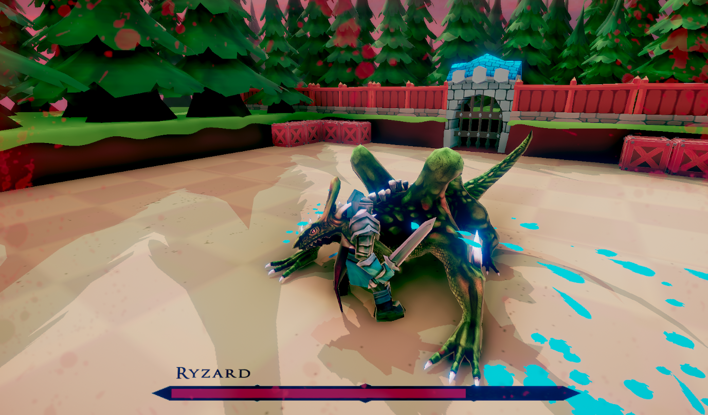
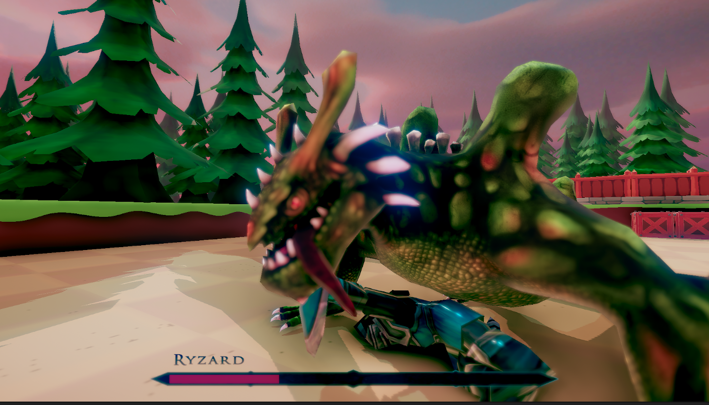

# Adaptive AI Boss

## Overview

Adaptive AI Boss is a Unity-based boss fight game developed as a three-member team project.

The project focuses on creating an engaging combat experience by combining adaptive AI, dynamic combat mechanics, and intelligent enemy behavior. The boss responds to player actions, creating a more challenging and immersive gameplay experience.

---

## Features

- Adaptive boss AI that adjusts behavior based on player actions
- Dynamic combat system
- Real-time player movement and dodge mechanics
- Enemy navigation using Unity NavMesh
- State-based AI architecture
- Character animations and visual effects
- Health and combat user interface

## Technologies Used

### Game Engine
- Unity

### Programming Language
- C#

### AI
- Adaptive AI
- Finite State Machine (FSM)
- Unity NavMesh

### Development Tools
- Visual Studio
- Git
- GitHub

## Project Structure

```text
adaptive-ai-boss/
├── Assets/
├── Packages/
├── ProjectSettings/
├── Screenshots/
├── README.md
├── LICENSE
└── .gitignore
```

## Screenshots

### Gameplay

<p align="center">
  
</p>

### Boss Defeat

<p align="center">
  
</p>

## Installation

### Requirements

- Unity 2021.3 LTS or later
- Visual Studio 2022

### Steps

1. Clone the repository.
2. Open the project in Unity Hub.
3. Load the main scene.
4. Press **Play** to start the game.

## Team

This project was developed as a three-member team project.

- Pratik Mallappa Kalloli
- Mutturaj Angadi
- Kamalkanth N

## Future Improvements

- Improve adaptive AI decision-making
- Add multiple boss behaviors
- Introduce difficulty scaling
- Expand combat mechanics
- Improve game environment and visual effects

## License

This project is licensed under the MIT License.
